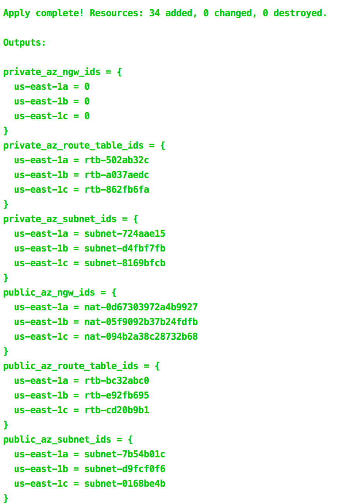

<!-- markdownlint-disable -->
<a href="https://cpco.io/homepage"></a><br/>
    <p align="right">
<a href="https://github.com/cloudposse/terraform-aws-multi-az-subnets/releases/latest"></a><a href="https://github.com/cloudposse/terraform-aws-multi-az-subnets/commits"></a><a href="https://slack.cloudposse.com"></a></p>
<!-- markdownlint-restore -->

<!--


  ** DO NOT EDIT THIS FILE
  **
  ** This file was automatically generated by the `cloudposse/build-harness`.
  ** 1) Make all changes to `README.yaml`
  ** 2) Run `make init` (you only need to do this once)
  ** 3) Run`make readme` to rebuild this file.
  **
  ** (We maintain HUNDREDS of open source projects. This is how we maintain our sanity.)
  **


-->

Terraform module for multi-AZ [`subnets`](http://docs.aws.amazon.com/AmazonVPC/latest/UserGuide/VPC_Subnets.html) provisioning.

The module creates private and public subnets in the provided Availability Zones.

The public subnets are routed to the Internet Gateway specified by `var.igw_id`.

`nat_gateway_enabled` flag controls the creation of NAT Gateways in the public subnets.

The private subnets are routed to the NAT Gateways provided in the `var.az_ngw_ids` map.

If you are creating subnets inside a VPC, consider using [cloudposse/terraform-aws-dynamic-subnets](https://github.com/cloudposse/terraform-aws-dynamic-subnets) instead.

## Screenshots

*Example of `terraform apply` outputs*


> [!TIP]
> #### 👽 Use Atmos with Terraform
> Cloud Posse uses [`atmos`](https://atmos.tools) to easily orchestrate multiple environments using Terraform. <br/>
> Works with [Github Actions](https://atmos.tools/integrations/github-actions/), [Atlantis](https://atmos.tools/integrations/atlantis), or [Spacelift](https://atmos.tools/integrations/spacelift).
>
> <details>
> <summary><strong>Watch demo of using Atmos with Terraform</strong></summary>
> <br/>
> <i>Example of running <a href="https://atmos.tools"><code>atmos</code></a> to manage infrastructure from our <a href="https://atmos.tools/quick-start/">Quick Start</a> tutorial.</i>
> </detalis>


## Usage

```hcl
locals {
  public_cidr_block  = cidrsubnet(var.cidr_block, 1, 0)
  private_cidr_block = cidrsubnet(var.cidr_block, 1, 1)
}

module "vpc" {
  source = "cloudposse/vpc/aws"
  # Cloud Posse recommends pinning every module to a specific version
  # version = "x.x.x"

  namespace  = var.namespace
  stage      = var.stage
  name       = var.name
  cidr_block = var.cidr_block
}

module "public_subnets" {
  source = "cloudposse/multi-az-subnets/aws"
  # Cloud Posse recommends pinning every module to a specific version
  # version = "x.x.x"

  namespace           = var.namespace
  stage               = var.stage
  name                = var.name
  availability_zones  = ["us-east-2a", "us-east-2b", "us-east-2c"]
  vpc_id              = module.vpc.vpc_id
  cidr_block          = local.public_cidr_block
  type                = "public"
  igw_id              = module.vpc.igw_id
  nat_gateway_enabled = "true"
}

module "private_subnets" {
  source = "cloudposse/multi-az-subnets/aws"
  # Cloud Posse recommends pinning every module to a specific version
  # version = "x.x.x"

  namespace          = var.namespace
  stage              = var.stage
  name               = var.name
  availability_zones = ["us-east-2a", "us-east-2b", "us-east-2c"]
  vpc_id             = module.vpc.vpc_id
  cidr_block         = local.private_cidr_block
  type               = "private"

  az_ngw_ids = module.public_subnets.az_ngw_ids
}
```

> [!IMPORTANT]
> In Cloud Posse's examples, we avoid pinning modules to specific versions to prevent discrepancies between the documentation
> and the latest released versions. However, for your own projects, we strongly advise pinning each module to the exact version
> you're using. This practice ensures the stability of your infrastructure. Additionally, we recommend implementing a systematic
> approach for updating versions to avoid unexpected changes.


## Examples

Given the following configuration

```hcl
module "vpc" {
  source = "cloudposse/vpc/aws"
  # Cloud Posse recommends pinning every module to a specific version
  # version = "x.x.x"

  namespace  = var.namespace
  name       = "vpc"
  stage      = var.stage
  cidr_block = var.cidr_block
}

locals {
  public_cidr_block  = cidrsubnet(module.vpc.vpc_cidr_block, 1, 0)
  private_cidr_block = cidrsubnet(module.vpc.vpc_cidr_block, 1, 1)
}

module "public_subnets" {
  source = "cloudposse/multi-az-subnets/aws"
  # Cloud Posse recommends pinning every module to a specific version
  # version = "x.x.x"

  namespace           = var.namespace
  stage               = var.stage
  name                = var.name
  availability_zones  = ["us-east-2a", "us-east-2b", "us-east-2c"]
  vpc_id              = module.vpc.vpc_id
  cidr_block          = local.public_cidr_block
  type                = "public"
  igw_id              = module.vpc.igw_id
  nat_gateway_enabled = "true"
}

module "private_subnets" {
  source = "cloudposse/multi-az-subnets/aws"
  # Cloud Posse recommends pinning every module to a specific version
  # version = "x.x.x"

  namespace           = var.namespace
  stage               = var.stage
  name                = var.name
  availability_zones  = ["us-east-2a", "us-east-2b", "us-east-2c"]
  vpc_id              = module.vpc.vpc_id
  cidr_block          = local.private_cidr_block
  type                = "private"
  az_ngw_ids          = module.public_subnets.az_ngw_ids
}

output "private_az_subnet_ids" {
  value = module.private_subnets.az_subnet_ids
}

output "public_az_subnet_ids" {
  value = module.public_subnets.az_subnet_ids
}
```

the output Maps of AZ names to subnet IDs look like these

```hcl
public_az_subnet_ids = {
  us-east-2a = subnet-ea58d78e
  us-east-2b = subnet-556ee131
  us-east-2c = subnet-6f54db0b
}
private_az_subnet_ids = {
  us-east-2a = subnet-376de253
  us-east-2b = subnet-9e53dcfa
  us-east-2c = subnet-a86fe0cc
}
```

and the created subnet IDs could be found by the AZ names using `map["key"]` or [`lookup(map, key, [default])`](https://www.terraform.io/docs/configuration/interpolation.html#lookup-map-key-default-),

for example:

`public_az_subnet_ids["us-east-2a"]`

`lookup(private_az_subnet_ids, "us-east-2b")`
<br/>

> [!TIP]
> #### Use Terraform Reference Architectures for AWS
>
> Use Cloud Posse's ready-to-go [terraform architecture blueprints](https://cloudposse.com/reference-architecture/) for AWS to get up and running quickly.
>
> ✅ We build it together with your team.<br/>
> ✅ Your team owns everything.<br/>
> ✅ 100% Open Source and backed by fanatical support.<br/>
>
> <a href="https://cpco.io/commercial-support?utm_source=github&utm_medium=readme&utm_campaign=cloudposse/terraform-aws-multi-az-subnets&utm_content=commercial_support"></a>
> <details><summary>📚 <strong>Learn More</strong></summary>
>
> <br/>
>
> Cloud Posse is the leading [**DevOps Accelerator**](https://cpco.io/commercial-support?utm_source=github&utm_medium=readme&utm_campaign=cloudposse/terraform-aws-multi-az-subnets&utm_content=commercial_support) for funded startups and enterprises.
>
> *Your team can operate like a pro today.*
>
> Ensure that your team succeeds by using Cloud Posse's proven process and turnkey blueprints. Plus, we stick around until you succeed.
> #### Day-0:  Your Foundation for Success
> - **Reference Architecture.** You'll get everything you need from the ground up built using 100% infrastructure as code.
> - **Deployment Strategy.** Adopt a proven deployment strategy with GitHub Actions, enabling automated, repeatable, and reliable software releases.
> - **Site Reliability Engineering.** Gain total visibility into your applications and services with Datadog, ensuring high availability and performance.
> - **Security Baseline.** Establish a secure environment from the start, with built-in governance, accountability, and comprehensive audit logs, safeguarding your operations.
> - **GitOps.** Empower your team to manage infrastructure changes confidently and efficiently through Pull Requests, leveraging the full power of GitHub Actions.
>
> <a href="https://cpco.io/commercial-support?utm_source=github&utm_medium=readme&utm_campaign=cloudposse/terraform-aws-multi-az-subnets&utm_content=commercial_support"></a>
>
> #### Day-2: Your Operational Mastery
> - **Training.** Equip your team with the knowledge and skills to confidently manage the infrastructure, ensuring long-term success and self-sufficiency.
> - **Support.** Benefit from a seamless communication over Slack with our experts, ensuring you have the support you need, whenever you need it.
> - **Troubleshooting.** Access expert assistance to quickly resolve any operational challenges, minimizing downtime and maintaining business continuity.
> - **Code Reviews.** Enhance your team’s code quality with our expert feedback, fostering continuous improvement and collaboration.
> - **Bug Fixes.** Rely on our team to troubleshoot and resolve any issues, ensuring your systems run smoothly.
> - **Migration Assistance.** Accelerate your migration process with our dedicated support, minimizing disruption and speeding up time-to-value.
> - **Customer Workshops.** Engage with our team in weekly workshops, gaining insights and strategies to continuously improve and innovate.
>
> <a href="https://cpco.io/commercial-support?utm_source=github&utm_medium=readme&utm_campaign=cloudposse/terraform-aws-multi-az-subnets&utm_content=commercial_support"></a>
> </details>


<!-- markdownlint-disable -->
## Makefile Targets
```text
Available targets:

  help                                Help screen
  help/all                            Display help for all targets
  help/short                          This help short screen
  lint                                Lint terraform code

```
<!-- markdownlint-restore -->
<!-- markdownlint-disable -->
## Requirements

| Name | Version |
|------|---------|
| <a name="requirement_terraform"></a> [terraform](#requirement\_terraform) | >= 0.13.0 |
| <a name="requirement_aws"></a> [aws](#requirement\_aws) | >= 3.0 |
| <a name="requirement_local"></a> [local](#requirement\_local) | >= 1.2 |
| <a name="requirement_null"></a> [null](#requirement\_null) | >= 2.0 |

## Providers

| Name | Version |
|------|---------|
| <a name="provider_aws"></a> [aws](#provider\_aws) | >= 3.0 |

## Modules

| Name | Source | Version |
|------|--------|---------|
| <a name="module_private_label"></a> [private\_label](#module\_private\_label) | cloudposse/label/null | 0.24.1 |
| <a name="module_public_label"></a> [public\_label](#module\_public\_label) | cloudposse/label/null | 0.24.1 |
| <a name="module_this"></a> [this](#module\_this) | cloudposse/label/null | 0.25.0 |

## Resources

| Name | Type |
|------|------|
| [aws_eip.public](https://registry.terraform.io/providers/hashicorp/aws/latest/docs/resources/eip) | resource |
| [aws_nat_gateway.public](https://registry.terraform.io/providers/hashicorp/aws/latest/docs/resources/nat_gateway) | resource |
| [aws_network_acl.private](https://registry.terraform.io/providers/hashicorp/aws/latest/docs/resources/network_acl) | resource |
| [aws_network_acl.public](https://registry.terraform.io/providers/hashicorp/aws/latest/docs/resources/network_acl) | resource |
| [aws_route.default](https://registry.terraform.io/providers/hashicorp/aws/latest/docs/resources/route) | resource |
| [aws_route.public](https://registry.terraform.io/providers/hashicorp/aws/latest/docs/resources/route) | resource |
| [aws_route.public_ipv6](https://registry.terraform.io/providers/hashicorp/aws/latest/docs/resources/route) | resource |
| [aws_route_table.private](https://registry.terraform.io/providers/hashicorp/aws/latest/docs/resources/route_table) | resource |
| [aws_route_table.public](https://registry.terraform.io/providers/hashicorp/aws/latest/docs/resources/route_table) | resource |
| [aws_route_table_association.private](https://registry.terraform.io/providers/hashicorp/aws/latest/docs/resources/route_table_association) | resource |
| [aws_route_table_association.public](https://registry.terraform.io/providers/hashicorp/aws/latest/docs/resources/route_table_association) | resource |
| [aws_subnet.private](https://registry.terraform.io/providers/hashicorp/aws/latest/docs/resources/subnet) | resource |
| [aws_subnet.public](https://registry.terraform.io/providers/hashicorp/aws/latest/docs/resources/subnet) | resource |

## Inputs

| Name | Description | Type | Default | Required |
|------|-------------|------|---------|:--------:|
| <a name="input_additional_tag_map"></a> [additional\_tag\_map](#input\_additional\_tag\_map) | Additional key-value pairs to add to each map in `tags_as_list_of_maps`. Not added to `tags` or `id`.<br>This is for some rare cases where resources want additional configuration of tags<br>and therefore take a list of maps with tag key, value, and additional configuration. | `map(string)` | `{}` | no |
| <a name="input_attributes"></a> [attributes](#input\_attributes) | ID element. Additional attributes (e.g. `workers` or `cluster`) to add to `id`,<br>in the order they appear in the list. New attributes are appended to the<br>end of the list. The elements of the list are joined by the `delimiter`<br>and treated as a single ID element. | `list(string)` | `[]` | no |
| <a name="input_availability_zones"></a> [availability\_zones](#input\_availability\_zones) | List of Availability Zones (e.g. `['us-east-1a', 'us-east-1b', 'us-east-1c']`) | `list(string)` | n/a | yes |
| <a name="input_az_ngw_ids"></a> [az\_ngw\_ids](#input\_az\_ngw\_ids) | Only for private subnets. Map of AZ names to NAT Gateway IDs that are used as default routes when creating private subnets.<br>You should either supply one NAT Gateway ID for each AZ in `var.availability_zones` or leave the map empty.<br>If empty, no default egress route will be created and you will have to create your own using `aws_route`. | `map(string)` | `{}` | no |
| <a name="input_cidr_block"></a> [cidr\_block](#input\_cidr\_block) | Base CIDR block which is divided into subnet CIDR blocks (e.g. `10.0.0.0/16`) | `string` | n/a | yes |
| <a name="input_context"></a> [context](#input\_context) | Single object for setting entire context at once.<br>See description of individual variables for details.<br>Leave string and numeric variables as `null` to use default value.<br>Individual variable settings (non-null) override settings in context object,<br>except for attributes, tags, and additional\_tag\_map, which are merged. | `any` | <pre>{<br>  "additional_tag_map": {},<br>  "attributes": [],<br>  "delimiter": null,<br>  "descriptor_formats": {},<br>  "enabled": true,<br>  "environment": null,<br>  "id_length_limit": null,<br>  "label_key_case": null,<br>  "label_order": [],<br>  "label_value_case": null,<br>  "labels_as_tags": [<br>    "unset"<br>  ],<br>  "name": null,<br>  "namespace": null,<br>  "regex_replace_chars": null,<br>  "stage": null,<br>  "tags": {},<br>  "tenant": null<br>}</pre> | no |
| <a name="input_delimiter"></a> [delimiter](#input\_delimiter) | Delimiter to be used between ID elements.<br>Defaults to `-` (hyphen). Set to `""` to use no delimiter at all. | `string` | `null` | no |
| <a name="input_descriptor_formats"></a> [descriptor\_formats](#input\_descriptor\_formats) | Describe additional descriptors to be output in the `descriptors` output map.<br>Map of maps. Keys are names of descriptors. Values are maps of the form<br>`{<br>   format = string<br>   labels = list(string)<br>}`<br>(Type is `any` so the map values can later be enhanced to provide additional options.)<br>`format` is a Terraform format string to be passed to the `format()` function.<br>`labels` is a list of labels, in order, to pass to `format()` function.<br>Label values will be normalized before being passed to `format()` so they will be<br>identical to how they appear in `id`.<br>Default is `{}` (`descriptors` output will be empty). | `any` | `{}` | no |
| <a name="input_enabled"></a> [enabled](#input\_enabled) | Set to false to prevent the module from creating any resources | `bool` | `null` | no |
| <a name="input_environment"></a> [environment](#input\_environment) | ID element. Usually used for region e.g. 'uw2', 'us-west-2', OR role 'prod', 'staging', 'dev', 'UAT' | `string` | `null` | no |
| <a name="input_id_length_limit"></a> [id\_length\_limit](#input\_id\_length\_limit) | Limit `id` to this many characters (minimum 6).<br>Set to `0` for unlimited length.<br>Set to `null` for keep the existing setting, which defaults to `0`.<br>Does not affect `id_full`. | `number` | `null` | no |
| <a name="input_igw_id"></a> [igw\_id](#input\_igw\_id) | Internet Gateway ID that is used as a default route when creating public subnets (e.g. `igw-9c26a123`) | `string` | `""` | no |
| <a name="input_ipv6_cidr_block"></a> [ipv6\_cidr\_block](#input\_ipv6\_cidr\_block) | Base IPv6 CIDR block which is divided into /64 subnet CIDR blocks | `string` | `null` | no |
| <a name="input_ipv6_enabled"></a> [ipv6\_enabled](#input\_ipv6\_enabled) | Flag to enable/disable IPv6 creation in public subnets | `bool` | `false` | no |
| <a name="input_label_key_case"></a> [label\_key\_case](#input\_label\_key\_case) | Controls the letter case of the `tags` keys (label names) for tags generated by this module.<br>Does not affect keys of tags passed in via the `tags` input.<br>Possible values: `lower`, `title`, `upper`.<br>Default value: `title`. | `string` | `null` | no |
| <a name="input_label_order"></a> [label\_order](#input\_label\_order) | The order in which the labels (ID elements) appear in the `id`.<br>Defaults to ["namespace", "environment", "stage", "name", "attributes"].<br>You can omit any of the 6 labels ("tenant" is the 6th), but at least one must be present. | `list(string)` | `null` | no |
| <a name="input_label_value_case"></a> [label\_value\_case](#input\_label\_value\_case) | Controls the letter case of ID elements (labels) as included in `id`,<br>set as tag values, and output by this module individually.<br>Does not affect values of tags passed in via the `tags` input.<br>Possible values: `lower`, `title`, `upper` and `none` (no transformation).<br>Set this to `title` and set `delimiter` to `""` to yield Pascal Case IDs.<br>Default value: `lower`. | `string` | `null` | no |
| <a name="input_labels_as_tags"></a> [labels\_as\_tags](#input\_labels\_as\_tags) | Set of labels (ID elements) to include as tags in the `tags` output.<br>Default is to include all labels.<br>Tags with empty values will not be included in the `tags` output.<br>Set to `[]` to suppress all generated tags.<br>**Notes:**<br>  The value of the `name` tag, if included, will be the `id`, not the `name`.<br>  Unlike other `null-label` inputs, the initial setting of `labels_as_tags` cannot be<br>  changed in later chained modules. Attempts to change it will be silently ignored. | `set(string)` | <pre>[<br>  "default"<br>]</pre> | no |
| <a name="input_max_subnets"></a> [max\_subnets](#input\_max\_subnets) | Maximum number of subnets that can be created. The variable is used for CIDR blocks calculation | `string` | `"6"` | no |
| <a name="input_name"></a> [name](#input\_name) | ID element. Usually the component or solution name, e.g. 'app' or 'jenkins'.<br>This is the only ID element not also included as a `tag`.<br>The "name" tag is set to the full `id` string. There is no tag with the value of the `name` input. | `string` | `null` | no |
| <a name="input_namespace"></a> [namespace](#input\_namespace) | ID element. Usually an abbreviation of your organization name, e.g. 'eg' or 'cp', to help ensure generated IDs are globally unique | `string` | `null` | no |
| <a name="input_nat_gateway_enabled"></a> [nat\_gateway\_enabled](#input\_nat\_gateway\_enabled) | Flag to enable/disable NAT Gateways creation in public subnets | `string` | `"true"` | no |
| <a name="input_private_network_acl_egress"></a> [private\_network\_acl\_egress](#input\_private\_network\_acl\_egress) | Egress network ACL rules | `list(map(string))` | <pre>[<br>  {<br>    "action": "allow",<br>    "cidr_block": "0.0.0.0/0",<br>    "from_port": 0,<br>    "protocol": "-1",<br>    "rule_no": 100,<br>    "to_port": 0<br>  }<br>]</pre> | no |
| <a name="input_private_network_acl_id"></a> [private\_network\_acl\_id](#input\_private\_network\_acl\_id) | Network ACL ID that is added to the private subnets. If empty, a new ACL will be created | `string` | `""` | no |
| <a name="input_private_network_acl_ingress"></a> [private\_network\_acl\_ingress](#input\_private\_network\_acl\_ingress) | Egress network ACL rules | `list(map(string))` | <pre>[<br>  {<br>    "action": "allow",<br>    "cidr_block": "0.0.0.0/0",<br>    "from_port": 0,<br>    "protocol": "-1",<br>    "rule_no": 100,<br>    "to_port": 0<br>  }<br>]</pre> | no |
| <a name="input_public_network_acl_egress"></a> [public\_network\_acl\_egress](#input\_public\_network\_acl\_egress) | Egress network ACL rules | `list(map(string))` | <pre>[<br>  {<br>    "action": "allow",<br>    "cidr_block": "0.0.0.0/0",<br>    "from_port": 0,<br>    "protocol": "-1",<br>    "rule_no": 100,<br>    "to_port": 0<br>  }<br>]</pre> | no |
| <a name="input_public_network_acl_id"></a> [public\_network\_acl\_id](#input\_public\_network\_acl\_id) | Network ACL ID that is added to the public subnets. If empty, a new ACL will be created | `string` | `""` | no |
| <a name="input_public_network_acl_ingress"></a> [public\_network\_acl\_ingress](#input\_public\_network\_acl\_ingress) | Egress network ACL rules | `list(map(string))` | <pre>[<br>  {<br>    "action": "allow",<br>    "cidr_block": "0.0.0.0/0",<br>    "from_port": 0,<br>    "protocol": "-1",<br>    "rule_no": 100,<br>    "to_port": 0<br>  }<br>]</pre> | no |
| <a name="input_regex_replace_chars"></a> [regex\_replace\_chars](#input\_regex\_replace\_chars) | Terraform regular expression (regex) string.<br>Characters matching the regex will be removed from the ID elements.<br>If not set, `"/[^a-zA-Z0-9-]/"` is used to remove all characters other than hyphens, letters and digits. | `string` | `null` | no |
| <a name="input_stage"></a> [stage](#input\_stage) | ID element. Usually used to indicate role, e.g. 'prod', 'staging', 'source', 'build', 'test', 'deploy', 'release' | `string` | `null` | no |
| <a name="input_tags"></a> [tags](#input\_tags) | Additional tags (e.g. `{'BusinessUnit': 'XYZ'}`).<br>Neither the tag keys nor the tag values will be modified by this module. | `map(string)` | `{}` | no |
| <a name="input_tenant"></a> [tenant](#input\_tenant) | ID element \_(Rarely used, not included by default)\_. A customer identifier, indicating who this instance of a resource is for | `string` | `null` | no |
| <a name="input_type"></a> [type](#input\_type) | Type of subnets to create (`private` or `public`) | `string` | `"private"` | no |
| <a name="input_vpc_id"></a> [vpc\_id](#input\_vpc\_id) | VPC ID | `string` | n/a | yes |

## Outputs

| Name | Description |
|------|-------------|
| <a name="output_az_ngw_ids"></a> [az\_ngw\_ids](#output\_az\_ngw\_ids) | Map of AZ names to NAT Gateway IDs (only for public subnets) |
| <a name="output_az_route_table_ids"></a> [az\_route\_table\_ids](#output\_az\_route\_table\_ids) | Map of AZ names to Route Table IDs |
| <a name="output_az_subnet_arns"></a> [az\_subnet\_arns](#output\_az\_subnet\_arns) | Map of AZ names to subnet ARNs |
| <a name="output_az_subnet_cidr_blocks"></a> [az\_subnet\_cidr\_blocks](#output\_az\_subnet\_cidr\_blocks) | Map of AZ names to subnet CIDR blocks |
| <a name="output_az_subnet_ids"></a> [az\_subnet\_ids](#output\_az\_subnet\_ids) | Map of AZ names to subnet IDs |
| <a name="output_az_subnet_ipv6_cidr_blocks"></a> [az\_subnet\_ipv6\_cidr\_blocks](#output\_az\_subnet\_ipv6\_cidr\_blocks) | Map of AZ names to subnet IPv6 CIDR blocks |
| <a name="output_az_subnet_map"></a> [az\_subnet\_map](#output\_az\_subnet\_map) | Map of AZ names to map of information about subnets |
<!-- markdownlint-restore -->


## Related Projects

Check out these related projects.

- [terraform-aws-named-subnets](https://github.com/cloudposse/terraform-aws-named-subnets) - Terraform module for named subnets provisioning.
- [terraform-aws-dynamic-subnets](https://github.com/cloudposse/terraform-aws-dynamic-subnets) - Terraform module for public and private subnets provisioning in existing VPC
- [terraform-aws-vpc](https://github.com/cloudposse/terraform-aws-vpc) - Terraform Module that defines a VPC with public/private subnets across multiple AZs with Internet Gateways
- [terraform-aws-cloudwatch-flow-logs](https://github.com/cloudposse/terraform-aws-cloudwatch-flow-logs) - Terraform module for enabling flow logs for vpc and subnets.


## ✨ Contributing

This project is under active development, and we encourage contributions from our community.


Many thanks to our outstanding contributors:

<a href="https://github.com/cloudposse/terraform-aws-multi-az-subnets/graphs/contributors">
  
</a>

For 🐛 bug reports & feature requests, please use the [issue tracker](https://github.com/cloudposse/terraform-aws-multi-az-subnets/issues).

In general, PRs are welcome. We follow the typical "fork-and-pull" Git workflow.
 1. Review our [Code of Conduct](https://github.com/cloudposse/terraform-aws-multi-az-subnets/?tab=coc-ov-file#code-of-conduct) and [Contributor Guidelines](https://github.com/cloudposse/.github/blob/main/CONTRIBUTING.md).
 2. **Fork** the repo on GitHub
 3. **Clone** the project to your own machine
 4. **Commit** changes to your own branch
 5. **Push** your work back up to your fork
 6. Submit a **Pull Request** so that we can review your changes

**NOTE:** Be sure to merge the latest changes from "upstream" before making a pull request!

### 🌎 Slack Community

Join our [Open Source Community](https://cpco.io/slack?utm_source=github&utm_medium=readme&utm_campaign=cloudposse/terraform-aws-multi-az-subnets&utm_content=slack) on Slack. It's **FREE** for everyone! Our "SweetOps" community is where you get to talk with others who share a similar vision for how to rollout and manage infrastructure. This is the best place to talk shop, ask questions, solicit feedback, and work together as a community to build totally *sweet* infrastructure.

### 📰 Newsletter

Sign up for [our newsletter](https://cpco.io/newsletter?utm_source=github&utm_medium=readme&utm_campaign=cloudposse/terraform-aws-multi-az-subnets&utm_content=newsletter) and join 3,000+ DevOps engineers, CTOs, and founders who get insider access to the latest DevOps trends, so you can always stay in the know.
Dropped straight into your Inbox every week — and usually a 5-minute read.

### 📆 Office Hours <a href="https://cloudposse.com/office-hours?utm_source=github&utm_medium=readme&utm_campaign=cloudposse/terraform-aws-multi-az-subnets&utm_content=office_hours"></a>

[Join us every Wednesday via Zoom](https://cloudposse.com/office-hours?utm_source=github&utm_medium=readme&utm_campaign=cloudposse/terraform-aws-multi-az-subnets&utm_content=office_hours) for your weekly dose of insider DevOps trends, AWS news and Terraform insights, all sourced from our SweetOps community, plus a _live Q&A_ that you can’t find anywhere else.
It's **FREE** for everyone!
## License

<a href="https://opensource.org/licenses/Apache-2.0"></a>

<details>
<summary>Preamble to the Apache License, Version 2.0</summary>
<br/>
<br/>

Complete license is available in the [`LICENSE`](LICENSE) file.

```text
Licensed to the Apache Software Foundation (ASF) under one
or more contributor license agreements.  See the NOTICE file
distributed with this work for additional information
regarding copyright ownership.  The ASF licenses this file
to you under the Apache License, Version 2.0 (the
"License"); you may not use this file except in compliance
with the License.  You may obtain a copy of the License at

  https://www.apache.org/licenses/LICENSE-2.0

Unless required by applicable law or agreed to in writing,
software distributed under the License is distributed on an
"AS IS" BASIS, WITHOUT WARRANTIES OR CONDITIONS OF ANY
KIND, either express or implied.  See the License for the
specific language governing permissions and limitations
under the License.
```
</details>

## Trademarks

All other trademarks referenced herein are the property of their respective owners.


---
Copyright © 2017-2024 [Cloud Posse, LLC](https://cpco.io/copyright)


<a href="https://cloudposse.com/readme/footer/link?utm_source=github&utm_medium=readme&utm_campaign=cloudposse/terraform-aws-multi-az-subnets&utm_content=readme_footer_link"></a>


